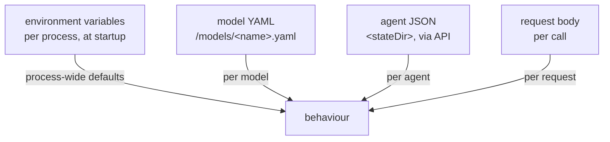

# Configuration map

Where each setting lives. This stack has **four** configuration surfaces, and knowing which one
owns a given behaviour is most of the work in changing it.

## The four surfaces



| Surface | Scope | Changed by | Takes effect |
|---|---|---|---|
| Environment variables | one process | restart | at startup |
| Model YAML | one model | file edit | next model load |
| Agent JSON | one agent | API or UI | immediately |
| Request body | one request | the caller | immediately |

Precedence is not a single chain — the surfaces mostly govern different things. Where they do
overlap, the narrower scope wins: an agent's `model` overrides `LOCALAGI_MODEL`, and an agent's
`api_url` overrides `LOCALAGI_LLM_API_URL`.

## Which surface owns what

The lookup table. If you are hunting for a knob, start here.

| Behaviour | Surface | Setting |
|---|---|---|
| Listen address | env | `LOCALAI_ADDRESS`, `LISTENING_ADDRESS` (LocalAGI: **hardcoded 3000**) |
| Which models install at startup | **command arguments** | positional args to `local-ai` |
| Context window | model YAML | `parameters.context_size` |
| Tool-calling behaviour | model YAML | `options: [use_jinja:true]`, `function.grammar.disable`, `template.use_tokenizer_template` |
| GPU layer offload | model YAML | `gpu_layers` |
| Whether a model serves embeddings | model YAML | `embeddings: true` |
| Which model an agent uses | agent JSON | `model` |
| Which inference server an agent uses | agent JSON, else env | `api_url`, else `LOCALAGI_LLM_API_URL` |
| Whether an agent retrieves | agent JSON | `enable_kb`, `kb_auto_search`, `kb_results` |
| Which collection an agent uses | **nothing — derived** | the lowercased agent name |
| Which tools an agent has | agent JSON | `actions`, `mcp_servers`, `mcp_stdio_servers` |
| Delegation targets | agent JSON | `call_agents` config `whitelist` / `blacklist` |
| Chunk size and overlap | env | `MAX_CHUNKING_SIZE`, `CHUNK_OVERLAP` |
| Vector engine | env | `VECTOR_ENGINE` |
| Hybrid search weights | env | `HYBRID_SEARCH_*`, `BM25_TEXT_CONFIG` |
| Embedding model | env | `EMBEDDING_MODEL` |
| Per-model-call timeout | env | `LOCALAGI_TIMEOUT` |
| Conversation TTL | env | `LOCALAGI_CONVERSATION_DURATION` |
| Temperature, max tokens | **request body** | per call |
| Streaming | request body — **ignored on `/v1/responses`** | `stream` |

Two rows deserve emphasis because people look for a setting that does not exist.

**The collection name is not configurable.** It is derived from the agent name, trimmed and
lowercased. Two agents differing only in case share one collection; renaming an agent orphans
its knowledge.

**`temperature` and `top_p` on `/v1/responses` are reported as `0` and are not the way to set
them.** Set them on the agent or on the model.

## Model YAML

Generated by a gallery install, and editable afterwards. This is the reference LLM's, verbatim
from the gallery's own `config_file`:

```yaml
name: qwen3-1.7b
backend: llama-cpp
known_usecases:
  - chat
parameters:
  context_size: 8192
  f16: true
  mmap: true
  model: Qwen3-1.7B.Q4_K_M.gguf
stopwords:
  - <|im_end|>
  - <dummy32000>
  - </s>
  - <|endoftext|>
options:
  - use_jinja:true
function:
  grammar:
    disable: true
template:
  use_tokenizer_template: true
```

Three things in that file are load-bearing and easy to lose:

**`use_jinja: true`** delegates templating to llama.cpp's jinja runtime, so its autoparser can
classify `<think>…</think>` blocks into `reasoning_content` natively. Without it, reasoning tags
leak into content.

**`function.grammar.disable: true`** lets llama.cpp's native name-first tool pipeline run.
LocalAI's own generated grammar would otherwise override it and the tool-call JSON leaks into
content.

**`template.use_tokenizer_template: true`** hands prompt templating to the backend.

Upstream's comments in `gallery/qwen3.yaml` cite the specific issues each avoids. **A
hand-written YAML missing these will not call tools reliably** — which is the most common cause
of an agent that answers in prose instead of using its tools.

Note also `context_size: 8192`, not the model's native 32,768. Raising it quadruples the KV-cache
reservation.

```bash
docker exec localai cat /models/qwen3-1.7b.yaml
```

## Agent JSON

Created through `POST /api/agent/create`, stored in `<stateDir>`, readable back:

```bash
curl -s http://localhost:8081/api/agent/<name>/config | jq
```

The fields that actually change behaviour, grouped:

### Identity and model

| Field | Note |
|---|---|
| `name` | also **determines the collection name**, lowercased |
| `model` | a real model name, resolved against LocalAI |
| `api_url`, `api_key` | per-agent inference override |
| `system_prompt` | standing instruction |
| `multimodal_model`, `transcription_model`, `tts_model` | optional modalities |

### Knowledge

| Field | Note |
|---|---|
| `enable_kb` | **off by default**; failures log at DEBUG only |
| `kb_auto_search` | retrieve on every request |
| `kb_as_tools` | expose `search_memory` / `add_memory` instead |
| `kb_results` | top-*k*; your only relevance lever |
| `long_term_memory`, `summary_long_term_memory` | write conversation back into the collection |
| `local_rag_url`, `local_rag_api_key` | per-agent knowledge service override |
| `enable_kb_compaction`, `kb_compaction_interval`, `kb_compaction_summarize` | compaction — **not exercised in our validation** |

### Tools

| Field | Note |
|---|---|
| `actions` | list of `{name, config}` — **`config` is a JSON string**, not an object |
| `mcp_servers` | `{url, token}` — HTTP transport |
| `mcp_stdio_servers` | `{name, cmd, args, env}` — child processes |
| `mcp_prepare_script` | runs before MCP setup |

`"config": "{}"` quoted as a string is correct. Sending an object is the most common reason an
agent silently has no tools.

### Loop behaviour

| Field | Note |
|---|---|
| `enable_reasoning`, `enable_reasoning_tool` | forced reasoning — **more model calls per iteration** |
| `enable_guided_tools` | constrained tool selection |
| `max_attempts` | retries before surfacing an error; `1` = none |
| `loop_detection` | breaks repetition |
| `max_evaluation_loops`, `enable_evaluation` | self-evaluation |
| `parallel_jobs` | concurrency **within one process** |
| `strip_thinking_tags` | removes `<think>` blocks from replies |
| `enable_auto_compaction`, `auto_compaction_threshold` | context compaction |

### Autonomy — read this as a permission grant

| Field | Effect |
|---|---|
| `periodic_runs` | runs on a schedule |
| `initiate_conversations` | starts conversations itself |
| `permanent_goal` | pursues a standing objective |
| `standalone_job` | runs as a job |
| `connectors` | **external parties can trigger it** |
| `can_stop_itself` | may terminate its own loop |
| `enable_planning`, `plan_reviewer_model` | planning |

Anything in this group means the agent acts without a request, which changes the threat model —
see [the security model](../07-deep-dives/security-model.md).

## Where the same knob has three names

The clearest illustration of [logical versus physical](../00-overview/logical-vs-physical.md).
The same LocalRecall settings are read under different names depending on which process linked
the library:

| Setting | Standalone LocalRecall | Standalone LocalAGI | Inside LocalAI |
|---|---|---|---|
| engine | `VECTOR_ENGINE` | `VECTOR_ENGINE` | `LOCALAI_AGENT_POOL_VECTOR_ENGINE` |
| embedding model | `EMBEDDING_MODEL` | `EMBEDDING_MODEL` | `LOCALAI_AGENT_POOL_EMBEDDING_MODEL` |
| chunk size | `MAX_CHUNKING_SIZE` | `MAX_CHUNKING_SIZE` | `LOCALAI_AGENT_POOL_MAX_CHUNKING_SIZE` |
| chunk overlap | `CHUNK_OVERLAP` | `CHUNK_OVERLAP` | `LOCALAI_AGENT_POOL_CHUNK_OVERLAP` |
| database | `DATABASE_URL` | `DATABASE_URL` | `LOCALAI_AGENT_POOL_DATABASE_URL` |
| collection path | `COLLECTION_DB_PATH` | `COLLECTION_DB_PATH` | `LOCALAI_AGENT_POOL_COLLECTION_DB_PATH` |

Same code, three namespaces. **Configuration written for one deployment shape silently does
nothing in another** — no warning, no error, just defaults.

Note also that standalone LocalAGI reads LocalRecall's variables **un-prefixed**. Setting
`LOCALAGI_EMBEDDING_MODEL` does nothing.

## Changing things safely

| Change | Requires | Affects existing data? |
|---|---|---|
| Agent fields | nothing — immediate | no |
| `MAX_CHUNKING_SIZE`, `CHUNK_OVERLAP` | restart | **no** — only documents ingested afterwards |
| `EMBEDDING_MODEL` | restart | **yes — invalidates every existing vector** |
| `VECTOR_ENGINE` | restart | **yes** — a different store; data does not migrate |
| Model YAML | next model load | no |
| `LOCALAGI_TIMEOUT` | restart | no |
| Hybrid search weights | restart | no — scoring only |

The `EMBEDDING_MODEL` row is the one that destroys data value silently: at the same dimension,
writes succeed and retrieval simply gets worse. Treat it as part of a collection's identity.

## Reading configuration back

```bash
docker run --rm localai/localai:v4.8.2 --help
```

The authoritative list of LocalAI's 148 environment bindings, with defaults.

```bash
docker inspect localagi --format '{{range .Config.Env}}{{println .}}{{end}}'
```

What a container actually received. Use `inspect`, not `exec printenv` — **LocalRecall's image
has no shell.**

```bash
curl -s http://localhost:8081/api/agent/config/metadata | jq
```

LocalAGI's own field metadata: every configurable field with its type and default, which is the
closest thing to generated documentation for the agent schema.

## Related

- [Environment variables](environment-variables.md)
- [Storage map](storage-map.md)
- [Ports](ports.md)

## Upstream references

- [LocalAI `core/cli/run.go`](https://github.com/mudler/LocalAI/blob/v4.8.2/core/cli/run.go) — all environment bindings; the `LOCALAI_AGENT_POOL_*` group at 125-143. Validated against v4.8.2.
- [LocalAI `core/config/backend_config.go`](https://github.com/mudler/LocalAI/blob/v4.8.2/core/config/backend_config.go) — the model YAML schema.
- [LocalAI `gallery/qwen3.yaml`](https://github.com/mudler/LocalAI/blob/v4.8.2/gallery/qwen3.yaml) — the reference model's `config_file`, with upstream's comments on `use_jinja` and grammar.
- [LocalAGI `core/state/config.go`](https://github.com/mudler/LocalAGI/blob/v2.9.0/core/state/config.go) — the complete `AgentConfig` struct and its field metadata. Validated against v2.9.0.
- [LocalAGI `cmd/env.go`](https://github.com/mudler/LocalAGI/blob/v2.9.0/cmd/env.go) — the un-prefixed LocalRecall variables at 59-63.
- [LocalAGI `webui/routes.go`](https://github.com/mudler/LocalAGI/blob/v2.9.0/webui/routes.go) — `/api/agent/config/metadata` at 90.
- [LocalRecall `main.go`](https://github.com/mudler/LocalRecall/blob/v0.6.4/main.go) — the complete variable set at 15-49. Validated against v0.6.4.
- The 148 count, the model YAML contents and the agent config round-trip: observed 2026-08-17, see [version matrix](../00-overview/version-matrix.md).
