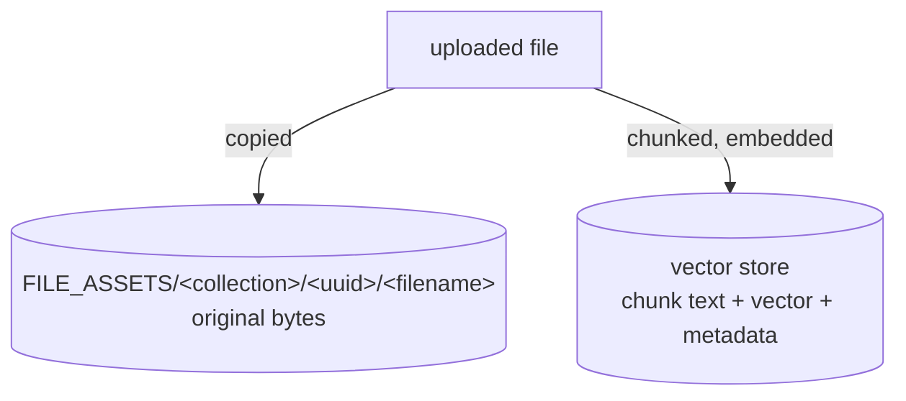

# Storage map

Every path and store the stack writes to, who owns it, and what breaks if it disappears.

The operational treatment — backup, restore, migration — is
[persistence](../06-deployment/persistence.md). This page is the lookup table.

## Everything, in one table

Sizes observed on the reference environment after the validation run: four agents, one small
collection, two models.

| Path / store | Owner | Contents | Observed | Lose it and… |
|---|---|---|---|---|
| `/models` | LocalAI | weights, generated model YAML | **1.503 GB** | re-download |
| `/backends` | LocalAI | backend binaries (OCI artifacts) | **160 MB** | re-download on next load |
| `/configuration` | LocalAI | runtime settings | **0 B** | settings reset |
| `/data` (Pattern A only) | LocalAI | agent state, collection DB, tasks, jobs | — | **all agents gone** |
| `<stateDir>` (`/pool`) | LocalAGI | **agent definitions**, tokens, connector config | **6.1 kB** | **all agents gone** |
| `<stateDir>/conversations` | LocalAGI | turn-by-turn audit log, if enabled | — | audit trail only |
| `<stateDir>/skills` | LocalAGI | skill definitions | — | skills gone |
| `FILE_ASSETS` | LocalRecall | **original uploaded documents** | **460 B** | raw endpoints 404; cannot re-ingest |
| `COLLECTION_DB_PATH` | LocalRecall | collection registry | — | collections unlisted |
| chromem file | LocalRecall | chunks + vectors, when `VECTOR_ENGINE=chromem` | — | **all knowledge gone** |
| PostgreSQL | LocalRecall | chunks + vectors, when `VECTOR_ENGINE=postgres` | **66.23 MB** | **all knowledge gone** |
| process memory | LocalAGI | conversation history, action history | — | nothing durable was there |

Two observations that should shape any backup plan:

**The irreplaceable data is kilobytes.** 6.1 kB of agent definitions against 1.5 GB of models.

**PostgreSQL has a large floor.** 66 MB for a single 207-byte document is the database's
baseline, not your data. Do not extrapolate storage needs from a small collection.

## Volume names in the reference environment

```bash
docker system df -v | grep localai-stack
```

| Volume | Mounted at | Service |
|---|---|---|
| `localai-stack_localai-models` | `/models` | localai |
| `localai-stack_localai-backends` | `/backends` | localai |
| `localai-stack_localai-configuration` | `/configuration` | localai |
| `localai-stack_localagi-pool` | `/pool` | localagi |
| `localai-stack_localrecall-data` | `/data` | localrecall |
| `localai-stack_postgres-data` | `/var/lib/postgresql/data` | postgres |

## Where a document ends up: twice

The coupling that causes the most confusing failure.



| Restore only | Result |
|---|---|
| the vector store | search works; `/entries/<x>/raw` **404s**; re-chunking impossible |
| the assets | files present; **nothing can find them** |

With `VECTOR_ENGINE=postgres` these are **different volumes**. Back them up together or not at
all — nothing detects or repairs the inconsistency, and you will find out months later.

With `chromem` both live under `localrecall-data`, which is a genuine operational advantage of
the file engine.

Observed asset layout:

```text
/data/assets/kb-probe/e040fb16-4b0b-4970-9ca4-f30f909ee50d/kb-fact.txt
```

The upload API returns that as `key`: `"<uuid>/<filename>"`. Note that the **entry** name used
for deletion is the base filename, not the key.

## Path defaults, and the one that loses data

| Variable | Standalone LocalRecall | Inside LocalAGI |
|---|---|---|
| `COLLECTION_DB_PATH` | `./collections` — **working-directory-relative** | `<stateDir>/collections` |
| `FILE_ASSETS` | `./assets` — **working-directory-relative** | `<stateDir>/assets` |

LocalRecall's image is built `FROM scratch`, so "the working directory" is the **ephemeral
container layer**. Collections silently vanish on restart.

**Always set both explicitly, in both modes.** The reference environment does:

```yaml
- COLLECTION_DB_PATH=/data/collections
- FILE_ASSETS=/data/assets
```

This is also the hazard when migrating between embedded and standalone knowledge: the defaults
differ, so a migration that relies on them is a data hunt. See
[deployment patterns](../04-integration/deployment-patterns.md#migration-paths).

## Agent state is secret-bearing

`<stateDir>` holds more than configuration:

| Contents | Note |
|---|---|
| Agent definitions | JSON, one entry per agent |
| MCP bearer tokens | **plain text** |
| Per-agent `api_key`, `local_rag_api_key` | plain text |
| Connector config (Slack, GitHub, email, Telegram) | plain text |

Restrict access to the volume, and be careful where its backups go. See
[security](../06-deployment/security.md).

## What is never stored

Worth listing so nobody searches for it:

| Not stored | Where it exists instead |
|---|---|
| Conversation history | process memory, TTL'd (≤ 1 h), lost on restart |
| Retrieved context | assembled per request |
| Embedding vectors, on LocalAI's side | computed and returned; LocalAI stores nothing |
| Token usage | not recorded anywhere at the agent layer |
| Action history beyond the last 10 | in memory, then discarded |
| Similarity scores | a `Similarity` field exists in search results but was observed as `0` |

**LocalAI does not store vectors.** It computes them. Persistence is LocalRecall's job — except
under `VECTOR_ENGINE=localai`, where LocalAI's `/stores` API holds them, an engine with several
`not implemented` methods that should not be chosen for new work.

## Sizing

| Component | Grows with | Note |
|---|---|---|
| `/models` | number and size of models | the dominant term; 1.19 GiB for one 1.7B Q4 model |
| `/backends` | number of backend variants | 160 MB observed for llama-cpp |
| agent state | number of agents | 6.1 kB for four — negligible |
| assets | ingested bytes | your documents, verbatim |
| vector store | **chunks**, not documents | see below |

Vector storage is dominated by the vectors, not the text. For the reference 384-dimension
model, each vector is 384 float32 values — about **1.5 kB** before overhead. At the default
400-character chunk size, a chunk's vector is larger than its text.

So the useful estimate is:

```text
chunks ≈ document characters ÷ (MAX_CHUNKING_SIZE − CHUNK_OVERLAP)
vector bytes ≈ chunks × dimensions × 4
```

Raising `MAX_CHUNKING_SIZE` reduces storage and embedding cost roughly proportionally — which is
also the main lever for slow ingestion.

## Inspecting

```bash
docker exec localagi ls -la /pool
```

```bash
docker exec -e PGPASSWORD=localrecall localai-postgres \
  psql -U localrecall -d localrecall -c '\dt'
```

```bash
docker inspect localrecall --format '{{range .Mounts}}{{println .Destination}}{{end}}'
```

**LocalRecall's image has no shell**, so `docker exec` cannot inspect it. Use `docker inspect`
for its configuration and mounts, and the API for its contents:

```bash
curl -s http://localhost:8082/api/collections/<name>/entries | jq
```

## Related

- [Persistence](../06-deployment/persistence.md) — backup, restore, migration
- [Environment variables](environment-variables.md) — every path variable
- [LocalRecall storage](../03-localrecall/storage.md) — the three engines in detail

## Upstream references

- [LocalAI `Dockerfile`](https://github.com/mudler/LocalAI/blob/v4.8.2/Dockerfile) — `VOLUME /models /backends /configuration /data`. Validated against v4.8.2.
- [LocalAI `core/cli/run.go`](https://github.com/mudler/LocalAI/blob/v4.8.2/core/cli/run.go) — `LOCALAI_MODELS_PATH`, `LOCALAI_BACKENDS_PATH`, `LOCALAI_CONFIG_DIR`, `LOCALAI_DATA_PATH` at 46.
- [LocalAGI `cmd/serve.go`](https://github.com/mudler/LocalAGI/blob/v2.9.0/cmd/serve.go) — state-dir creation and state-dir-relative defaults at 38-53. Validated against v2.9.0.
- [LocalAGI `core/state/pool.go`](https://github.com/mudler/LocalAGI/blob/v2.9.0/core/state/pool.go) — pool JSON persistence.
- [LocalRecall `main.go`](https://github.com/mudler/LocalRecall/blob/v0.6.4/main.go) — working-directory-relative defaults at 33-45. Validated against v0.6.4.
- [LocalRecall `rag/persistency.go`](https://github.com/mudler/LocalRecall/blob/v0.6.4/rag/persistency.go) — the asset copy into `FILE_ASSETS/<collection>/<uuid>/`.
- [LocalRecall `Dockerfile`](https://github.com/mudler/LocalRecall/blob/v0.6.4/Dockerfile) — `FROM scratch`, hence no shell.
- [LocalRecall `rag/engine/localai.go`](https://github.com/mudler/LocalRecall/blob/v0.6.4/rag/engine/localai.go) — the `not implemented` methods.
- Volume sizes, asset layout, upload key format and embedding dimensions: observed 2026-08-17, see [version matrix](../00-overview/version-matrix.md).
